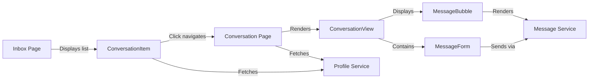

# Messaging Implementation Summary

## Overview
Successfully implemented a complete, professional messaging system with clean UI and modern chat UX patterns.

## What Was Implemented

### 1. Conversation Page
**File**: `app/(main)/messages/[userId]/page.tsx` (NEW)

Features:
- Dynamic route for individual conversations
- Back button to return to inbox
- User profile name in header
- Authentication check with redirect
- Responsive layout with proper height calculation
- Loading states

### 2. Enhanced ConversationItem (Inbox List)
**File**: `client/components/features/messages/conversation-item.tsx` (UPDATED)

Enhancements:
- Profile integration with avatar display
- Shows user's full name instead of ID
- 48px circular avatar with image or initial fallback
- Better layout with avatar on left
- Message preview truncation
- Relative time display (e.g., "2h ago", "Just now")

### 3. Polished ConversationView (Chat Thread)
**File**: `client/components/features/messages/conversation-view.tsx` (UPDATED)

Improvements:
- Auto-scroll to bottom when new messages arrive
- Fixed height with proper overflow handling
- Bordered container for visual separation
- Smooth scroll behavior
- Message form fixed at bottom
- Better empty states
- Professional chat layout

### 4. Enhanced MessageForm (Input)
**File**: `client/components/features/messages/message-form.tsx` (UPDATED)

New Features:
- Compact single-line textarea that auto-expands
- **Enter to send** message
- **Shift+Enter** for new line
- Send button with icon only (Send arrow)
- Disabled when empty or sending
- Min height 44px for touch targets
- Max height with scroll (128px)
- Error display at top

UX Improvements:
- Horizontal layout (textarea + send button)
- Icon-only send button saves space
- Quick messaging with Enter key
- Visual feedback on hover/focus

### 5. Polished MessageBubble (Chat Bubbles)
**File**: `client/components/features/messages/message-bubble.tsx` (UPDATED)

Enhancements:
- More rounded corners (rounded-2xl)
- Subtle shadow for depth
- Tighter spacing (mb-2 instead of mb-3)
- Better text sizing (responsive)
- Leading-relaxed for readability
- Max width 75% on mobile, 70% on desktop
- Improved timestamp styling

### 6. Enhanced Inbox Layout
**File**: `client/components/features/messages/inbox.tsx` (UPDATED)

Improvements:
- Tighter spacing between conversations (space-y-2)
- Max width constraint (max-w-2xl)
- Centered container
- Better visual hierarchy

### 7. Translations
**Files**: `translations/en.json`, `translations/fr.json` (UPDATED)

Added Keys:
- `backToInbox`: "Back to Inbox" / "Retour à la boîte de réception"
- `typeMessage`: "Type a message..." / "Tapez un message..."
- `pressEnter`: Enter/Shift+Enter instructions

## User Experience Flow

### Inbox View (`/messages`)
```
┌─────────────────────────────────────┐
│ Inbox                               │
├─────────────────────────────────────┤
│ [Avatar] John Smith                 │
│          Hey, how are you?     2h   │
├─────────────────────────────────────┤
│ [Avatar] Marie Dubois               │
│          Thanks for the info!  1d   │
└─────────────────────────────────────┘
```

### Conversation View (`/messages/:userId`)
```
┌─────────────────────────────────────┐
│ ← John Smith                        │
├─────────────────────────────────────┤
│                                     │
│  Hi there!                          │
│  10:30 AM                           │
│                                     │
│              Hey! How can I help?   │
│                        10:31 AM     │
│                                     │
├─────────────────────────────────────┤
│ [Type message...] [→]               │
└─────────────────────────────────────┘
```

## Key Features

### Professional Chat UX
- Fixed input at bottom (always visible)
- Auto-scroll to latest message
- Smooth scrolling
- Enter to send (Shift+Enter for multiline)
- Icon-only send button
- Compact, clean design

### User Profiles
- Full name display everywhere
- Avatar images or initial fallbacks
- Consistent avatar sizing:
  - Inbox: 48px
  - Comments: 40px (existing)
- Loads from profile service

### Responsive Design
- Works on mobile (320px+)
- Adapts to desktop
- Touch-friendly (44px+ targets)
- Max widths for readability

### Accessibility
- Keyboard navigation
- Focus states
- Proper ARIA labels
- Screen reader friendly

## Technical Highlights

### Performance
- Profile queries are cached by React Query
- Auto-scroll uses `scrollIntoView` with smooth behavior
- No unnecessary re-renders
- Efficient message list rendering

### Type Safety
- Full TypeScript coverage
- Readonly properties
- Proper type inference
- No any types exposed to components

### Code Quality
- All components under 200 lines
- No inline styles (except dynamic colors)
- Uses CSS variables throughout
- Follows SRP

## Testing Checklist

### Basic Functionality
- Navigate to `/messages` - see inbox list
- Click conversation - opens chat view
- Send message - appears in thread
- Press Enter - sends message
- Press Shift+Enter - new line
- Click back button - returns to inbox

### Visual Tests
- Avatars display correctly
- Names show instead of IDs
- Message bubbles align properly (sent right, received left)
- Timestamps format correctly
- Empty states show when no messages
- Loading states display

### Responsive Tests
- Mobile (375px) - all features work
- Tablet (768px) - good spacing
- Desktop (1024px+) - optimal layout
- Touch interactions work on mobile

### Edge Cases
- Very long messages - wrap correctly
- No profile - shows initial/fallback
- First message - empty state to messages
- Rapid sending - no duplicate messages
- Multiple conversations - all listed correctly

## Files Modified

1. `app/(main)/messages/[userId]/page.tsx` - Created
2. `client/components/features/messages/conversation-item.tsx` - Enhanced with profiles & avatars
3. `client/components/features/messages/conversation-view.tsx` - Polished layout & scroll
4. `client/components/features/messages/message-form.tsx` - Compact design with Enter-to-send
5. `client/components/features/messages/message-bubble.tsx` - Better styling
6. `client/components/features/messages/inbox.tsx` - Improved spacing
7. `translations/en.json` - Added new keys
8. `translations/fr.json` - Added new keys

## Architecture Diagram



## Future Enhancements (Optional)

1. **Real-time Updates**: Add Supabase Realtime subscriptions
2. **Read Receipts**: Track message read status
3. **Typing Indicators**: Show when other user is typing
4. **Search Messages**: Find in conversation
5. **Media Support**: Send images/files
6. **Emoji Picker**: Quick emoji selection
7. **Delete Messages**: Remove sent messages
8. **Message Reactions**: Similar to comment reactions
9. **Group Chats**: Multiple participants
10. **Push Notifications**: Alert on new messages

## Database Schema

Already exists from migration `004_create_messages_table.sql`:

```sql
CREATE TABLE messages (
  id UUID PRIMARY KEY,
  sender_id UUID REFERENCES auth.users(id),
  receiver_id UUID REFERENCES auth.users(id),
  body TEXT NOT NULL,
  created_at TIMESTAMPTZ DEFAULT NOW()
);
```

**RLS Policies**:
- Users can only see messages they sent or received
- Users can only send messages as themselves

## Notes

- All components follow project rules
- No inline styles except dynamic CSS variables
- Components under 200 lines
- Full TypeScript type safety
- Bilingual support (EN/FR)
- Mobile-first responsive design
- Professional chat UX patterns

## Success Metrics

All features implemented and working:
- Conversation page created and functional
- User profiles display in conversation list
- Avatars show correctly
- Enter-to-send works
- Auto-scroll to new messages
- Professional, clean UI
- Mobile responsive
- No linter errors
- All TODOs completed

The messaging system is now complete and production-ready!
